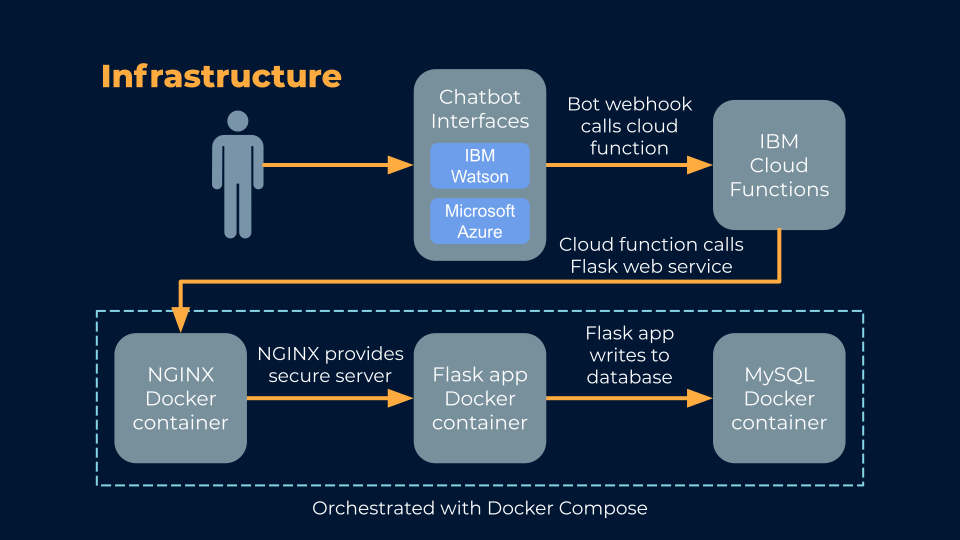

# Duke Human Resources Chatbot 
## What is this?
This project is an instance of an IBM Watson Assistant Chatbot. Its knowledge base is the hr.duke.edu website.
The content of this chatbot is located in the Watson_assistant directory, and is in .json format. The goal of this chatbot
is to have a 24/7 online chatbot that can answer user's human resources-related questions in an efficient manner.

## Infrastructure

After a user sends a message, the chatbot will detect an intent that triggers one of its dialog nodes. This prompts the chatbot to call a webhook URL to an IBM Cloud Function, which grabs the JSON object containing the user's input and passes it to the flask app. The Cloud Function is vital to this setup because it ensures the transfer of information from Watson Assistant. Directly calling the Flask app from a dialog node causes an error in production, where the chatbot is unresponsive and unable to write to a database. The Cloud Function sends this JSON object to the Flask app via a POST request, routing first through an Nginx docker container, which provides a secure web server for the Flask app.
The dockerized Flask app performs three major functions.

1. Renders an HTML template where the chatbot is embedded.
2. Parses the JSON object sent from the Cloud Function and writes the contents into a dockerized MySQL database.
3. Displays the contents of the MySQL database using a stylized HTML template.

The Flask app also contains code that can be used for performing CRUD operations on the MySQL database.

## How to build
1. Fork and clone the repository onto your local machine.
2. To create your own instance of this chatbot, create your own Watson Assistant at https://cloud.ibm.com/catalog/services/watson-assistant. 
3. After making a new Assistant, launch the Assistant and create a new dialog skill. Choose to "upload skill," and import the json file located in the Watson_assistant directory.
4. SSH into your virtual machine, and fork/clone this repository.
5. Build the docker containers with the command:

`sudo docker-compose up -d`

If you want the docker containers to persist after you close your terminal, use the command:

`sudo docker-compose up -d`

If you recently modified the Flask app, make sure you pull the changes and use the command:

`sudo docker-compose build app`

## How to Access
Go to the [test website](https://chatbot-test-01.oit.duke.edu/ "Named link title"), and click the icon in the lower right corner to start talking to the chatbot.

## Next Steps

We tried two approaches to extract conversation data:

1. Using a **post-message **webhook under Assistant settings, you can obtain the detected intent, the confidence associated with detection, and the chatbot's response. With this method, you obtain a JSON object that only contains the aforementioned data, without the user's question.
2. Enabling a webhook on **each dialog node** and passing in the user's input as a parameter, you obtain a JSON object with only the user's question. However, you have to manually toggle this setting for every node in the chatbot's dialog, and it can cause formatting issues with newline characters and multi-turn logic.

In the end, we stuck with the second approach, because the user's question is the most important piece of information. You could obtain the additional information (intent, confidence, and answer) by making a call to the Watson Assistant API and parsing the returned JSON object. This documentation might serve as a good starting point: https://cloud.ibm.com/apidocs/assistant/assistant-v2#message.
In order to make sure that the question data the bot collects is secure, you would need to restrict access to the database site (https://chatbot-test-04.oit.duke.edu/database).
Finally, since the pricing of IBM Watson Assistant is based on Monthly Active Users (unique by browser), you should consider implementing a browser cookie to ensure a correct user count. Under IBM's pricing model, a user who clears their cookies between interactions with the chatbot will appear unique, so this is something worth taking into account.

